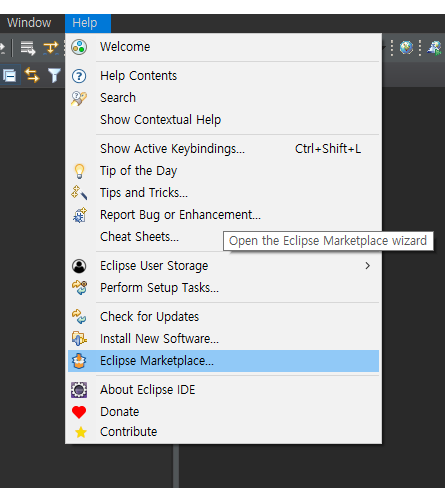
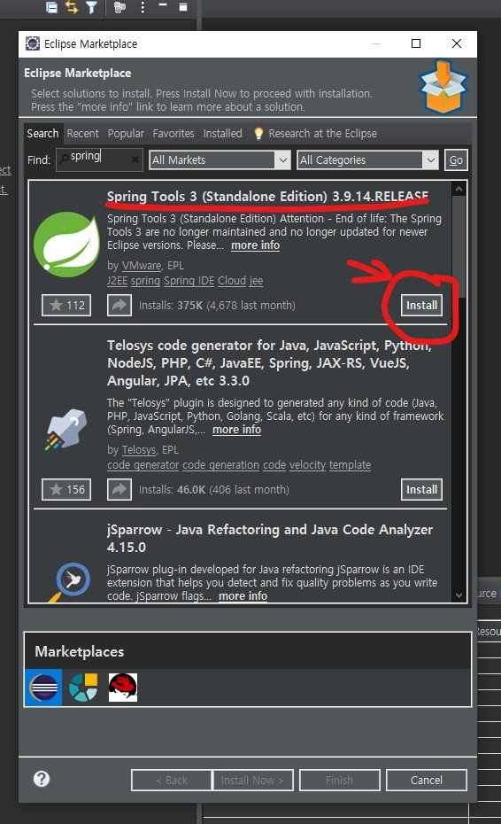
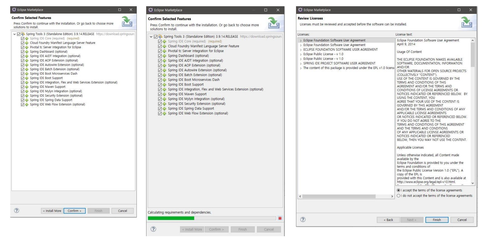
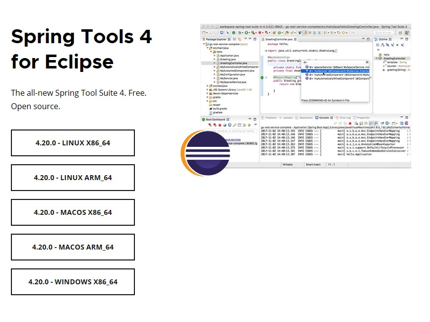

이 글은 자바 스프링의 시작을 위한 프로그램 다운을 알려주는 글입니다.   

글 시작 전 해당 [소스파일](https://github.com/sunghomong/TIL/tree/master/Spring/ex01)을 참고해주세요

# 스프링 시작하기
 
스프링 시작하기 위해서는 일단 이클립스 자체에서 다운하는 방법이 있고 STS다운 방법이 있다. 
두개의 다운방법을 알아보려고 한다.
 
  
- 이클립스를 활용한 sts플로그인 설치 방법
     

1. 이클립스 화면의 help 메뉴에서 Eclipse marketplace를 선택한다.
      
   
     
2. 선택한 후 marketplace에서 spring 툴즈 다운로드
     
   eclipse에서 환경을 만들어주기 위한 기본 툴즈를 다운 받는다.
      
   {: width="300" height="500" }
3. 다운로드 완료
     
   {: width="300" height="500" }
  
- STS 공식 홈페이지에서 다운로드
    
  1. STS 공식 [홈페이지](https://spring.io/tools) 들어가기 
     
    들어가시면 많은 프로그래밍 도구들이 보일겁니다. 본인이 평소에 사용하시는 도구로 다운을 받으시면 될 거 같습니다. 
    저는 이클립스 STS를 다운받았습니다.
      
    {: width="300" height="300"}{: .center}
     
    STS4의 경우는 Spring 홈페이지의 위와 같은 탭에서 각자 운영체제에 알맞은 툴을 다운로드하면 된다. 참고로 STS4의 경우는 Legacy Project를 바로 생성할 수가 없다. 만약 STS4로 Legacy Project를 생성하고 싶으면 Eclipse MarketPlace에서 STS3을 다운로드하여야 한다.

