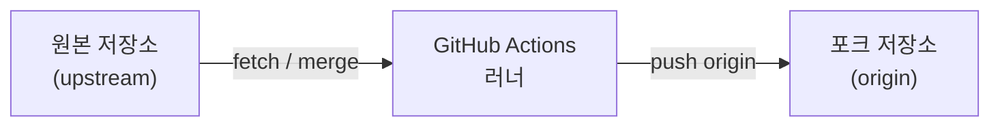

이미지 출처 : [https://simplelocalize.io/blog/github-app/github-actions-for-localization.jpg](https://simplelocalize.io/blog/github-app/github-actions-for-localization.jpg)

## 🧐 개발 배경

최근 회사 내 플랫폼을 리뉴얼하면서 Git 저장소 구조도 함께 바꿨다.

이전에는 **한 저장소에 팀원 계정을 초대**해 같은 레포에서 작업하고, `pull`,`merge` 후 **`dev`, `rel` 브랜치 기준으로 감아 배포**하는 방식이었다.

리뉴얼 이후에는 **원본 저장소를 포크해 개인/팀 레포에서 작업**하는 형태로 전환됐다.<br>
권한 및 협업 측면에서 이쪽이 더 맞는 선택인 것 같다.

포크 방식에서는 작업 전에 **upstream(원본)과 내 포크의 브랜치를 맞추는 과정**이 반복된다.<br>
싱크가 맞아야 다른 사람 작업분을 놓치지 않기 때문에 사실상 매번 해야 하는 일이었다.

로컬에서는 대략 **upstream fetch → merge(또는 rebase) → 포크로 push** 순서를 반복했는데, 이걸 매번 손으로 하기 번거로웠다.

그래서 **주기적으로 포크를 원본과 맞춰 주는 자동화 기능**을 찾아봤고, **GitHub Actions의 `schedule`**으로 해당 기능을 찾게 됐다.<br>
일정 주기마다 워크플로가 돌면서 원격 포크 브랜치를 upstream과 동기화하면, 작업 시작 전 수동 싱크 부담을 줄일 수 있다.

## ⚙️ 동기화 방식 & 흐름 설명

로컬에서 하던 **“upstream 최신 반영 → 포크로 push”**를 포크 레포 안의 GitHub Actions가 같은 Git 명령으로 대신 실행하는 구조다.<br>
GitHub 웹의 **“Sync fork”**와 동일한 기능으로, **`schedule`(주기)** 또는 **`workflow_dispatch`(수동)**으로 돌릴 수 있다.

**수동으로 하던 때와 비교하면,** 예전에는 **Sync fork**로 원격 포크를 맞춘 뒤 로컬에서 `pull`로 받고 작업했을 텐데, Actions는 그중 **“원격 포크를 upstream과 맞추는 단계”**를 자동으로 반복해 주는 작업을 해준다.



참고: [Fork a repository](https://docs.github.com/en/pull-requests/collaborating-with-pull-requests/working-with-forks/fork-a-repo), [Syncing a fork](https://docs.github.com/en/pull-requests/collaborating-with-pull-requests/working-with-forks/syncing-a-fork), [Workflow syntax for GitHub Actions — `on.schedule`](https://docs.github.com/en/actions/using-workflows/workflow-syntax-for-github-actions#onschedule)

### 1. 포크 저장소 설정 (push 가능하게)

1. **Workflow permissions**  
   **Settings** → **Actions** → **General** → **Workflow permissions**에서 **Read and write permissions**를 선택한다.
   기본이 읽기 전용이면 워크플로의 `git push`가 실패할 수 있다.

   

2. **PAT 시크릿 (`SYNC_PAT`) — 아래 `gh repo sync` 예시 기준**  
   GitHub CLI로 포크를 부모(upstream)와 맞출 때, `checkout`과 `gh`가 같은 인증을 쓰도록 **Personal access token**을 발급해 레포 시크릿 이름 **`SYNC_PAT`**으로 등록한다.

   - **Settings** → **Secrets and variables** → **Actions** → **New repository secret** → Name: `SYNC_PAT`
   - 토큰 발급: 프로필 **Settings** → **Developer settings** → **Personal access tokens**에서 **Fine-grained**(해당 포크·원본 접근 권한) 또는 **Tokens (classic)**(`repo` 등) 생성

3. **참고: 순수 `git merge` 방식만 쓸 때**  
   `remote add` → `fetch` → `merge` → `push`만 쓰는 워크플로라면 **기본 `GITHUB_TOKEN`**만으로 되는 경우가 많다. 이 글 하단 예시는 **`gh repo sync`**를 쓰므로 PAT를 두는 편이 무난하다.

### 2. 워크플로 파일 추가

- 경로: **`.github/workflows/*.yml`**
- 트리거: `schedule`(cron), 필요 시 `workflow_dispatch`
- 워크플로 상단에 `permissions: contents: write` 등, push에 맞는 권한을 명시한다.

### 3. 한 번 실행될 때의 흐름

**이 글의 예시(`gh repo sync`)**는 대략 다음과 같다.

1. 러너에서 잡을 시작한다.
2. `actions/checkout`으로 **포크**를 가져온다.
3. **`gh repo sync`**가 포크의 지정 브랜치를 **부모 저장소(upstream)** 기준으로 맞춘다. (내부적으로 fetch·merge·push에 해당하는 동기화)
4. `--force`를 쓰면 부모와 충돌할 때 **포크 쪽 히스토리를 덮어쓸 수 있으므로** 운영 정책에 맞게 사용할지 결정한다.

**대안:** 위 대신 `git remote add upstream` → `fetch` → `merge` → `push`를 스크립트로 직접 써도 동일한 목적이다.

### 4. 결과


- 이후 로컬에서는 `git pull origin develop`(예시 브랜치명) 등으로 포크 기준 최신을 받고 작업을 이어가면 된다.

[GitHub Actions 이해하기](https://docs.github.com/en/actions/get-started/understanding-github-actions)

## 📋 전제 조건

- **`schedule`(크론)으로 돌릴 때** GitHub은 **저장소 기본(default) 브랜치**에 올라간 워크플로 정의만 사용한다. 그래서 자동 동기화용 워크플로를 **실제로 쓰는 브랜치(예: `develop`)를 기본 브랜치로 바꾸거나**, 기본 브랜치에도 **동일한 `.github/workflows/...` 파일을 두어** 스케줄이 빠지지 않게 맞춰 둔다. ([Schedule 이벤트 설명](https://docs.github.com/en/actions/using-workflows/events-that-trigger-workflows#schedule))
- 동기화할 **브랜치 이름**을 정한다. (아래 예시는 **`develop`**, `main`이면 `-b` 값만 바꾸면 된다.)
- **포크 레포**에 워크플로를 둔다. (`.github/workflows/` 아래)
- `gh repo sync`는 포크와 **부모(upstream) 관계**가 이미 잡혀 있어야 한다. (GitHub에서 포크한 레포면 기본적으로 만족)
- 위 **1. 포크 저장소 설정**에서 **Workflow permissions**를 읽기/쓰기로 맞춰 두고, **`SYNC_PAT`** 시크릿을 등록한다.

## 💻 워크플로 예시

포크 레포 루트에 `.github/workflows/sync-upstream.yml` 파일을 만든다.


```yaml
name: Upstream Sync (Develop)

on:
  schedule:
    # UTC 기준 매일 22:30, 02:30, 06:30, 10:30, 14:30 (필요에 맞게 수정)
    - cron: "30 22,2,6,10,14 * * *"
  workflow_dispatch:

permissions:
  contents: write

jobs:
  sync_latest_from_upstream:
    runs-on: ubuntu-latest
    steps:
      - name: Checkout fork
        uses: actions/checkout@v4
        with:
          token: ${{ secrets.SYNC_PAT }}

      - name: Sync fork from upstream (GitHub CLI)
        env:
          GH_TOKEN: ${{ secrets.SYNC_PAT }}
        run: gh repo sync ${{ github.repository }} -b develop --force
```


- **`SYNC_PAT`**: 레포 **Settings → Secrets and variables → Actions**에 등록. Classic은 `repo`, Fine-grained는 이 포크(및 필요 시 원본)에 맞는 권한을 준다.
- **`-b develop`**: 맞출 브랜치명. 팀 기본 브랜치가 다르면 여기만 바꾼다.
- **`${{ github.repository }}`**: `포크소유자/포크레포`로 자동 치환되므로 본인 계정·레포 이름을 하드코딩하지 않아도 된다. (체크아웃한 그 포크가 대상)
- **`--force`**: 부모와 충돌 시 **포크 브랜치를 강제로 부모 쪽에 맞출 때** 쓴다. 포크 기본 브랜치에만 두는 “받기 전용” 동기화에 맞고, **포크에만 있는 커밋은 사라질 수 있으니** 운영 방식에 맞게 사용한다. 필요 없으면 제거해 본다.
- **`GH_TOKEN`**: `gh` CLI가 읽는 환경 변수다. (`GITHUB_TOKEN`과 동일 계열이지만 `gh` 권장명은 `GH_TOKEN`)
- `ubuntu-latest` 러너에는 **`gh`가 기본 설치**되어 있다.
- `cron`은 [crontab 형식](https://docs.github.com/en/actions/using-workflows/events-that-trigger-workflows#schedule)이며, GitHub은 **정각 부하 분산**을 위해 분을 흩어 쓰는 것을 권장한다.

## ⚠️ 주의할 점

1. **`--force`**  
   `gh repo sync`에 **`--force`를 쓰면** 부모와 어긋난 포크 브랜치를 **강제로 덮어쓴다**. 포크의 `develop` 등에 **직접 커밋해 두었다면** 그 커밋이 날아갈 수 있으니, 보통은 동기화 전용 브랜치로 쓰거나 `--force` 없이 시도한 뒤 실패 시에만 로컬에서 정리하는 편이 안전하다.

2. **스케줄 지연**  
   `schedule`은 **정확한 시각 보장이 아니다**. 저장소 활동이 없으면 실행이 늦어질 수 있어, “반드시 이 시각”이 필요하면 외부 스케줄러나 `workflow_dispatch`로 수동 실행을 병행하는 편이 낫다.

3. **private 원본**  
   원본이 private이면 Actions 러너에서 fetch 가능 여부가 달라질 수 있다. 이 경우 권한·토큰 범위를 별도로 맞춰야 한다.

4. **기본 브랜치 보호 규칙**  
   브랜치 보호로 **직접 push가 막혀 있으면** `git push`가 실패한다. 그때는 PR 자동 생성 액션 등 다른 패턴을 검토한다.

## 마무리

포크 후 매번 upstream을 손으로 맞추던 과정을 **GitHub Actions 스케줄**과 **`gh repo sync`**로 옮기면서, 작업 전 루틴이 한결 가벼워졌다. <br> 앞으로도 GitHub Actions을 활용 할 수 있게끔 학습을 더 해야될 것 같다.

<br>

[sunghomong 의 깃 허브](https://github.com/sunghomong) <br>
[sunghomong 의 블로그](https://sunghomong.github.io/)
